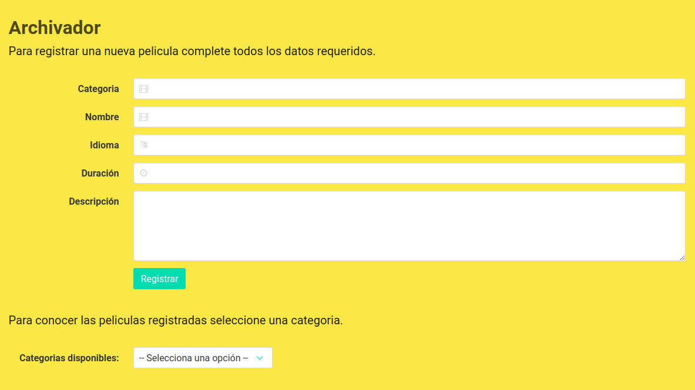

# Archivador_xml

Web desarrollada para el almacenaje de información y su posterior exhibición (en este caso se utilizarán películas). El ingreso de los datos se realiza a través de un formulario, los datos se almacenan en archivos XML, los cuales se crean a partir del nombre de la categoria que se ingresa. Para el despliegue de la información en pantalla, se dispone de un dropdown, que carga el contenido de los archivos XML. 

## Permisos

``` bash
sudo chmod 777 xml/
sudo chown www-data:www-data xml/*
```
## Imágenes de demostración



